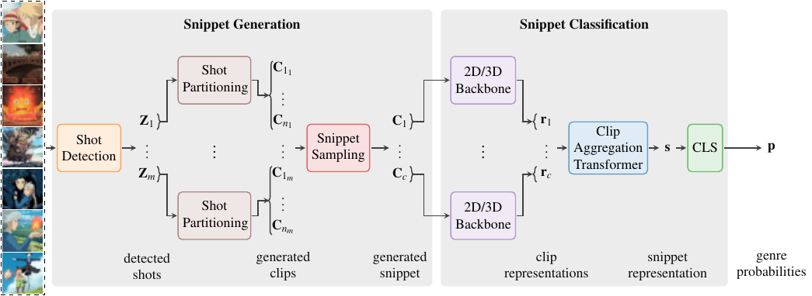

# *Trailers12k*: Evaluating Transfer Learning For Movie Trailer Genre Recognition

By [Ricardo Montalvo-Lezama](https://turing.iimas.unam.mx/~ricardoml/),
[Berenice Montalvo-Lezama](https://turing.iimas.unam.mx/~bereml/) and
[Gibran Fuentes-Pineda](http://turing.iimas.unam.mx/~gibranfp/).

This repo reproduces the main results of [*Trailers12k*: Evaluating Transfer Learning For Movie Trailer Genre Recognition]().

A description of the Trailers12k dataset can be found in the [site](https://richardtml.github.io/trailers12k/).




## Results

This results are presented in Table 6 of the paper.

| Backbone      | ImageNet-1K | Kinetics-400 | $\mu AP$  | $mAP$ | $wAP$  | $sAP$        |
| :---          |:-: |:-: | :-:        | :-:        | :-:        | :-:        |
| *Light Conv*  |    |    |            |            |            |            |
| ShuffleNet-2D | ✔ |    | 71.69±0.44 | 66.47±0.73 | 70.51±0.50 | 76.60±0.77 |
| ShuffleNet-3D |    | ✔ | 63.43±1.54 | 58.18±1.50 | 63.59±1.46 | 69.49±1.58 |
| *Heavy Conv*  |    |    |            |            |            |            |
| ResNet        | ✔ |    | 70.92±3.49 | 66.16±2.45 | 70.23±2.11 | 75.85±3.05 |
| R2+1D         |    | ✔ | 71.76±2.72 | 66.09±2.44 | 70.81±2.21 | 76.33±2.02 |
| *Transformer* |    |    |            |            |            |            |
| Swin-2D       | ✔ |    | 72.96±4.17 | 67.68±2.63 | 71.70±2.44 | 77.77±4.08 |
| Swin-3D       | ✔ | ✔ | 75.71±2.43 | 70.44±2.10 | 74.30±2.11 | 80.19±2.61 |


## Reproducing Results

To run the following experiment you will need 40GB of free space.

1. Create and activate the enviroment:

```sh
conda env create -f environment.yml
conda activate t12k
```

2. Download the data (it can take some hours). By default,
data will be saved to `trailers12k` directory.
You can also specify an alternative directory:
```sh
python download.py [/alternative/dir/trailers12k]
```

3. Run the experiment:
```sh
python experiment.py [/alternative/dir/trailers12k]
```

4. The results are saved to `results/transfer/tst.csv`.
